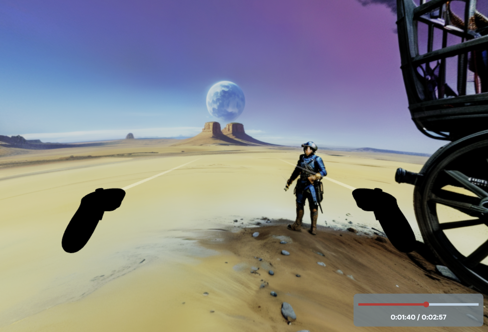

# VaudioR

>### Audiobooks made fun and AR.

We bring the fun in audiobooks by adding Augmented Reality to the experience.

  

How? The user can add the audiobook file in our mobile app and they can interact with the environment generated based on the audiobook selected.
Or they can record their own audiobook.

  

  

